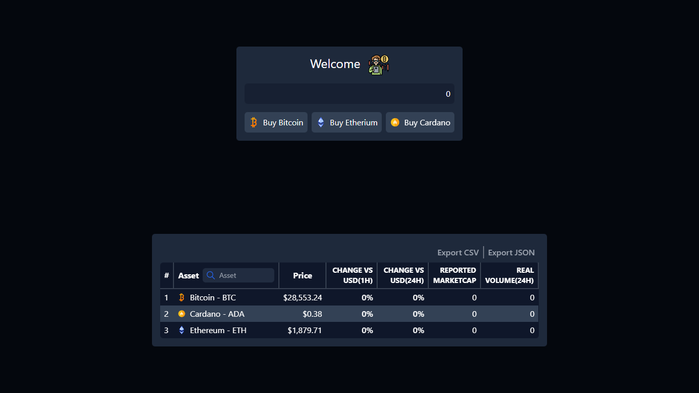

# Disruptive Studio

 Crypto app

## Frontend

Crypto app

### Author info

Shammael Bien-Aisé
[Email](mailto:shammamnd2015@gmail.com)
[Github](https://github.com/shammael)

### Project Repo

[Github](https://github.com/shammael/prueba-front)

### Some Tech used

1. [React](https://react.dev/blog/2023/03/16/introducing-react-dev)
2. [socket.io](https://socket.io/)
3. [Vite](https://vitejs.dev/)

### Scripts

```javascript
{
  "dev": "vite",
  "build": "tsc && vite build",
  "lint": "eslint src --ext ts,tsx --report-unused-disable-directives --max-warnings 0",
  "preview": "vite preview",
  "test": "vitest"
}
```

### Preview



#### Calculator

This component allow the user to enter an amount and get back the result and earnings in crypto and usd

We use a custom hook name calculator to fetch data, a function to trigger when the user click on one button and later return error if necessary

``` javascript
const Calculator = () => {
  const {
    error,
    getAmount,
    isLoading,
    result,
    setError,
    input: { setValue, value },
  } = useCalculator();

  return (
    <Box className="max-w-[450px]">
      <Header />
      <Input
        onChange={(e) => {
          setValue(e);
          setError("");
        }}
        value={value}
        error={error}
      />

      <ButtonGroups handleClick={getAmount} />

      {isLoading && <Loading />}
      {result && !isLoading && !error && (
        <Resume
          anualAmount={result.anualAmount}
          startingAmount={result.startingAmount}
          percentages={result.percentage}
          cryptoPrice={result.cryptoPrice}
          label={result.label}
        />
      )}
    </Box>
  );
};
```

#### Table Stats

We use this component with so many feature like download with csv or json to show user in realtime stats price and soon a trend graph

The ideal approach is the client get back what it need and if tomorrow the client wanna get back another crypto, just add it, but due to the api restriction 3 calls at least every 5 seconds, the most of time the app stuck due to 429 error status, use of context to share data in some others components, two hooks with realtime support and error handler to improve the user experience


```javascript
const AppTable = () => {
  const [search, setSearch] = useState("");
  const { metrics } = useContext(TableContext);

  const tableData = [
    { slug: "bitcoin", symbol: "btc" },
    { slug: "cardano", symbol: "ada" },
    { slug: "ethereum", symbol: "eth" },
  ];
  return (
    <div>
      <header className="flex items-center justify-end">
        <CSVLink
          data={metrics}
          className="text-gray-400 font-semibold hover:text-gray-200 cursor-pointer p-2"
          target="_blank"
          filename="data"
        >
          Export CSV
        </CSVLink>
        <HozLine />
        <button
          className="text-gray-400 font-semibold hover:text-gray-200 cursor-pointer p-2"
          onClick={() => exportData(metrics)}
        >
          Export JSON
        </button>
      </header>
      <table className="text-white bg-slate-900 rounded-md">
        <thead>
          <tr className="p-4 border-b-2 border-gray-700 h-auto">
            <th className="border-gray-700 border-r-2 px-2">#</th>
            <th className="gap-2 border-gray-700 border-r-2 px-2">
              <div className="flex gap-2 items-center">
                <p>Asset</p> <Input onChange={(value) => setSearch(value)} />
              </div>
            </th>
            <th className="px-2 border-gray-700 border-r-2">Price</th>
            <th className="gap-2 border-gray-700 border-r-2 px-2 text-sm text-end w-[100px]">
              CHANGE VS USD(1H)
            </th>

            <th className="gap-2 border-gray-700 border-r-2 px-2 text-sm text-end w-[100px]">
              CHANGE VS USD(24H)
            </th>
            <th className="gap-2 border-gray-700 border-r-2 px-2 text-sm text-end w-[100px]">
              <p>REPORTED MARKETCAP</p>
            </th>
            <th className="gap-2 border-gray-700 border-r-2 px-2 text-sm text-end w-[100px]">
              <p>REAL VOLUME(24H)</p>
            </th>
            {/* <th className="gap-2 border-gray-700 border-r-2 px-2 text-sm text-end w-[100px]">
              <p>/ DAY TRENDS</p>
            </th> */}
          </tr>
        </thead>

        <tbody>
          {tableData
            .filter((item) => {
              return search.toLowerCase() === ""
                ? item
                : item.slug.toLowerCase().includes(search) ||
                    item.symbol.toLowerCase().includes(search);
            })
            .map((row, index) => (
              <tr
                key={index}
                className={!Number.isInteger(index / 2) ? "bg-slate-700" : ""}
              >
                <Cell index={index + 1} slug={row.slug} symbol={row.symbol} />
              </tr>
            ))}
        </tbody>
      </table>
    </div>
  );
};
```

#### Realtime hooks

**useMetrics:** Fetch data like realVolume24h, change vs USD and others. In the back, it's powered by messari.io but due to the api restriction, few api calls can be made and the messari api is using polling not a stream

```javascript
const useMetrics = (symbol: string) => {
  const { metrics: contextMetrics } = useContext(TableContext);

  const metric = contextMetrics.find((met) => met.symbol === symbol);
  const [metrics, setMetrics] = useState<MetricsResponse>(
    metric
      ? metric
      : {
          id: "",
          symbol: "",
          marketcapUSD: 0,
          percentChangeUSD1h: 0,
          percentChangeUSD24h: 0,
          realVolume24h: 0,
          slug: "",
        }
  );

  const [error, setError] = useState<string>("");

  const { setMetrics: setContextMetrics } = useContext(TableContext);

  useEffect(() => {
    const socket = io("http://localhost:3000/api/v1/stream/metric");

    socket.emit("symbol", symbol);

    socket.on("metric", (metric) => {
      setMetrics(metric);
      setContextMetrics(metric);
    });

    socket.on("too-request-error", (error) => {
      setError(error.message);
    });
  }, [setContextMetrics, symbol]);

  return { metrics, error };
};

export default useMetrics;
```

**usePrice:** We use the API binance stream to update in realtime the price of every crypto, no api restriction noticed yet

```javascript
const usePrice = (symbol: string) => {
  const [price, setPrice] = useState(0);

  useEffect(() => {
    const socket = io("http://localhost:3000/api/v1/stream/bi");

    socket.emit("symbol", symbol);

    socket.on(`${symbol}-metrics`, (e) => {
      setPrice(e.p);
    });

    socket.on("disconnect", () => {
      console.log("ds");
    });

    socket.on("error", (e) => {
      console.log(e);
    });

    return () => {
      socket.off(`${symbol}-metrics`);
    };
  }, [symbol]);

  return { price };
};
```
